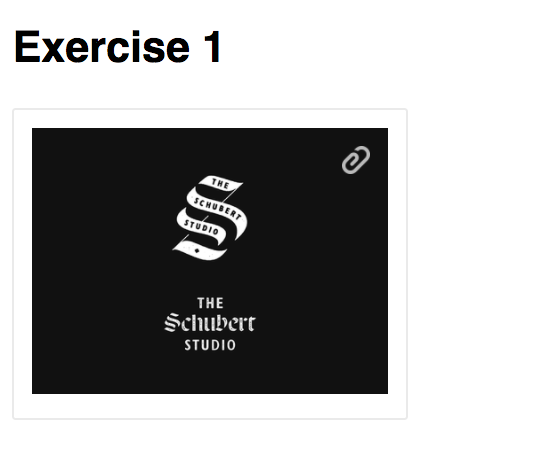
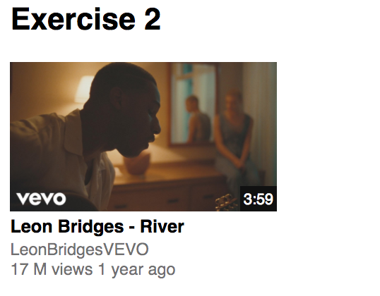

# Thumbnails

## Steps

- Fork the pen [CSS Positioning -- Activity](https://codepen.io/muktek/pen/mXOrQJ) to your profile.
- You’ll find two little and easy exercises.

**Not necessary to create a project in your local machine. Work just there, in your Codepen profile.**

### Indications

Please, check that I have two commented pieces of code.

###### FIRST ONE
```html

```

###### SECOND ONE
```html
<span class="media__timing">3:59</span>
```

## Final Results

#### According to CSS Positioning concepts, you need to put the first image in the right top corner. Like this:

```
DESIGN SPECS
=======================
dimensions
  16 x 16
  Use 20px to the right and top corners
  Make a pointer cursor appears when I hover the image
```



#### And second one, in the right bottom corner. Just like this:

```
DESIGN SPECS
=======================
dimensions
  font size: 12px
  Use 3px to add space between content and border
  fill color: rgb(17, 17, 17)
  text color: white
```



**Analyze your HTML structure and determine with your partner where you should add those tags. Remember that the structure matters.**
